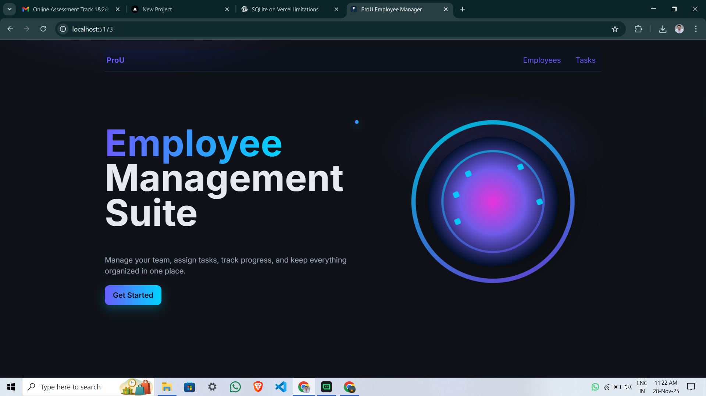
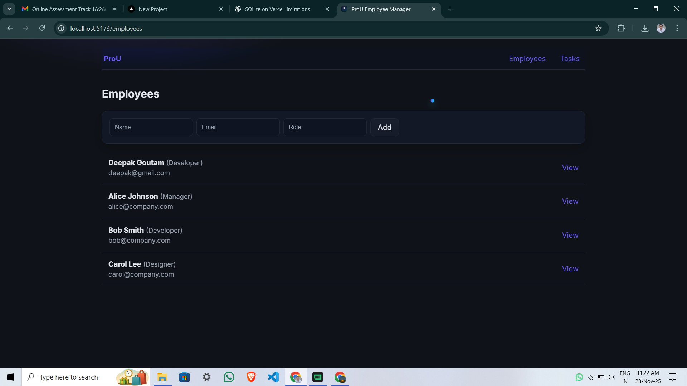
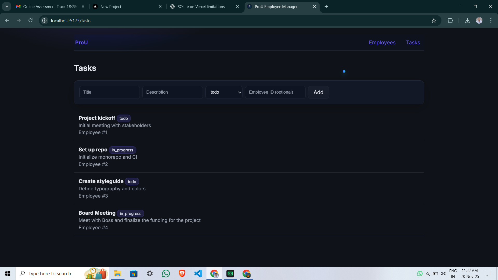

# ProU Employee Management

A full‑stack Employee & Task Manager delivering all three tracks:
- Frontend: Responsive React UI with mock mode
- Backend: REST API using Node.js + Express
- Database: SQLite (file‑based)

Includes a modern landing page, rotating orb animation, cursor‑dot trail, and clean UI for employees and tasks.

## Tech Stack
- Frontend: React (Vite)
- Backend: Node.js + Express
- Database: SQLite (file‑based)

## Project Structure
- `client`: React web UI
- `server`: Express REST API with SQLite

## Features
- Employees: list, view, create, update, delete
- Tasks: list, filter by `employee_id`/`status`, create, update, delete
- Landing page with gradient theme, rotating orb, cursor‑dot animation
- Mock data mode for frontend‑only development

## Local Setup
1. Prerequisites: Install `Node.js >= 18` and `npm`.
2. Frontend:
   - `cd client`
   - `npm install`
3. Backend:
   - `cd ../server`
   - `npm install`
4. Start API:
   - `npm run dev`
   - API at `http://localhost:4000/`
5. Start frontend:
   - In a new terminal: `cd ../client`
   - `npm run dev`
   - Open `http://localhost:5173/`

## Environment
- Frontend: `VITE_API_BASE` (default `http://localhost:4000/api`)
- Backend: `PORT` (default `4000`)

## Scripts
- Frontend: `npm run dev`, `npm run build`, `npm run preview`, `npm run lint`
- Backend: `npm run dev`, `npm run start`

## Using Mock Data (Frontend Track)
- The UI components include a `useMock` flag for demonstration. Set `useMock = true` in `client/src/pages/*.jsx` to use static JSON (`client/src/mockData.js`).

## API Endpoints (Backend Track)
- `GET /api/health` — health check
- Employees:
  - `GET /api/employees`
  - `GET /api/employees/:id`
  - `POST /api/employees` (body: `name`, `email`, `role`)
  - `PUT /api/employees/:id`
  - `DELETE /api/employees/:id`
  - `GET /api/employees/:id/tasks`
- Tasks:
  - `GET /api/tasks` (query: `status`, `employee_id` optional)
  - `GET /api/tasks/:id`
  - `POST /api/tasks` (body: `title`, `description?`, `status?`, `due_date?`, `employee_id?`)
  - `PUT /api/tasks/:id`
  - `DELETE /api/tasks/:id`

## Data Model
- `employees(id, name, email, role, created_at)`
- `tasks(id, title, description, status, due_date, employee_id, created_at)`

## Screenshots / Recording
- Home (Landing)
  
  

- Employees List
  
  

- Tasks List
  
  